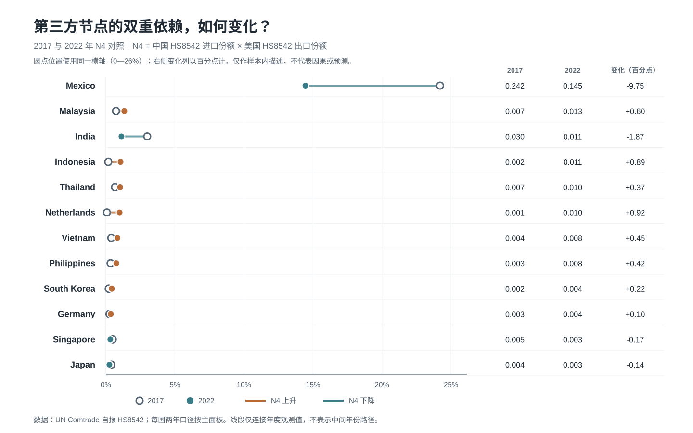
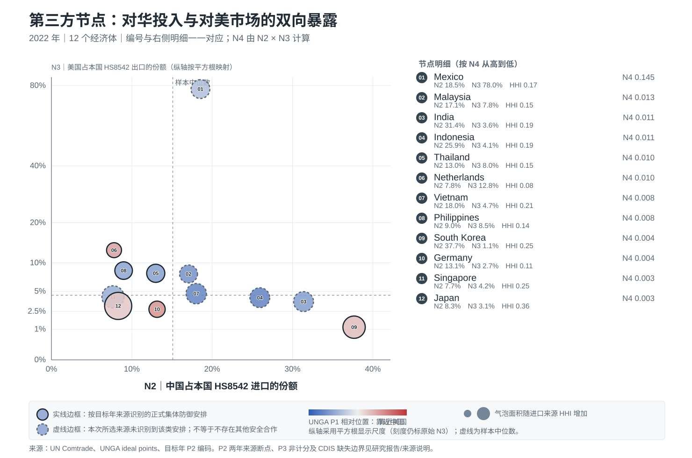

# 脱钩之后，风险去了哪里？
## 中美科技竞争下中国半导体企业第三方供应链去华化风险测量与地平线扫描

### 摘要

中国半导体企业把采购、生产和销售网络延伸至第三方经济体，可以降低直接暴露，但不必然消除地缘政治风险。风险可能沿中国投入、美国市场、东道国政治位置、技术管制和供应来源集中度重新聚集。本文对马来西亚等12个经济体进行2017与2022年比较。结果显示，墨西哥仍是2022年N4双重依赖最高的节点，但低于2017年；荷兰、印度尼西亚、马来西亚、越南、菲律宾和泰国的N4上升，说明风险在节点间重新分布。项目整合UN Comtrade、UNGA、ATOP、OECD TiVA、美国国务院/北约、OAS、BIS《联邦公报》和IMF CDIS等来源，并逐项保留来源年份与缺口。P2按目标年分别采用ATOP观察值及官方防务安排资料，明确披露跨源断点；BIS所选10条候选规则已逐条做范围核对，但复核集合并非全量法律审查，只作为不计分证据。GTRI-v0仅汇总已审计核心字段，另输出多源连接审计和不计分背景层。

### 一、问题与风险机制

本文关注的不是一般国别风险，而是中国半导体企业使用第三方供应链节点后面临的去华化风险传导。其核心不确定性有三层：第一，东道国与大国竞争的政治位置可能改变政策约束；第二，跨国客户的合规要求可能沿供应链向上游传导；第三，集中进口来源或单一市场依赖会放大政策冲击。因而，第三国不是天然的风险避风港，而可能成为新的夹层节点。

本文的分析对象是12个经济体，基准年为2022年，回测年为2017年。指标按政治制度压力P、供应链网络暴露N和产业脆弱性V三层组织。这个结构对应企业的实际决策：先识别制度压力，再看中国投入和美国市场暴露，最后判断替代来源是否充足。

### 二、指标体系与数据

P1是联合国大会理想点的中美相对位置。对每个国家，在目标年中心的三年窗口内计算其到中国和美国的平均距离，再计算“到中国距离/(到中国距离+到美国距离)”。P1越大，表示投票位置相对更靠近美国。P2测量所选正式集体防御安排：2017年以ATOP v5.1观察值为基础；2022年逐国核对美国国务院《Treaties in Force 2020》及覆盖至2023年的官方补编、目标年国务院双边材料和北约成员加入年份。停更的旧版国务院安排清单只作为历史索引，不单独充当2022状态快照；原文和哈希一并留存。两年来源方法不同，不能解释成严格同源变化。墨西哥2017年保留ATOP原始值1，同时依据OAS记录的2004年《里约条约》退出状态，将“目标年仍有效的正式安排”核验为0；这一OAS例外不用于墨西哥2022编码。P3来自BIS历史规则；已逐条范围核对10条选定候选规则，但集合非穷尽，不等于覆盖全部规则、实体与产品范围，因此不计入国家总分。

N1采用OECD TiVA C26_27行业的电子产业外国增加值占出口比重，衡量电子产业全球价值链嵌入。N2为从中国进口HS8542占该国全球HS8542进口比重；N3为对美国出口HS8542占全球HS8542出口比重；N4=N2×N3，识别同时依赖中国投入与美国市场的夹层结构。V1为HS8542进口来源HHI，V2为进口份额达到1%的有效供应国数量。UN Comtrade主模型始终使用研究国家自报数据，避免混用镜像统计。

Comtrade原始响应、清洗结果、查询参数、来源登记与哈希在复现工作目录分层保存；提交展示包则提供审计面板与必要的公开源文件。清洗过程去除World等汇总项，保留真实伙伴记录；国家—年份主表执行一对一键检查。

### 三、测量验证

**图1 2017—2022年N4双重依赖变化**

**图2 2022年中美半导体夹层节点**

图1展示跨年变化，图2展示中国投入端与美国市场端的同时暴露。两图均基于本报告核心面板，单位和计算口径见《数据与方法说明》。

第一类验证是人工核对参考值。2022年马来西亚的N2、N3、N4、V1和V2分别为0.1706、0.0784、0.01338、0.14835和13；越南分别为0.18024、0.04659、0.00840、0.20627和9，均在预设容差内。这些参考值用于检查口径，不是独立第三方预测验证。第二类是内部一致性：24条观测中N4与N2×N3的最大误差约为9.19×10^-17，国家—年份键无重复，比例与HHI均位于0至1区间。第三类是来源连接审计：24行、15项跨源连接/边界检查通过，并逐字段登记主表46列的来源、转换、连接键和边界；另生成22条“数据源×目标年”覆盖记录。检查包括P2目标年及逐国证据链接、美国国务院原始文件、墨西哥2017条约冲突、P3非穷尽范围、CDIS滞后与缺失值保留。通过只表示按既定规则正确连接，不代表指数准确率。第四类是2017—2022结构对照：P1、N2、N3、N4、V2的国家排序相关分别为0.958、0.636、0.524、0.434、0.292。该对照是描述性分析，不构成严格无前视回测、因果识别或预测准确率证明。

补充证据层包括BIS规则人工范围核对和IMF CDIS投资头寸。BIS层在选定的10条候选规则中识别到1个“直接增加管制”的国家—年份命中（日本2022）；其他零值只表示本次复核集合未记到命中。CDIS保留两个报告方向：样本经济体报告的对华流入头寸、以及中国报告的对样本经济体流出头寸。2022目标行使用2021年末观测并标记滞后一年；流入方向4/24未报告、流出方向9/24未报告，均不填成零。该数据按直接对手方统计，不是半导体专项投资，也不代表最终所有者，故只用于背景解释，不计分。

### 四、AI工作流与人机边界

本项目的AI作用不是替代判断，而是把赛道A中的数据编码、口径审计、地平线扫描和可视化交付变成可复现流程。AI辅助完成了UN Comtrade批量抓取脚本、清洗规则、指标公式检查、异常值日志、BIS《联邦公报》候选文本抽取、网页交互原型和报告结构迭代。人工环节主要负责研究问题界定、指标含义确认、马来西亚和越南2022年外部基准核验、P3法律证据是否可以入表的边界判断。

一个关键失效案例反而强化了本项目的审计设计：早期自动文本扫描会把BIS规则标题或正文中的国家提及直接当作“该国受到管制”，但法规提及并不等于法律适用对象。项目因此将P3降级为证据队列和编码协议，不把未复核文本强行转成国家分数。这一处理体现了AI辅助社会科学测量的基本原则：机器负责扩大搜索和一致性检查，人负责定义口径、确认含义和阻止伪精确。

### 五、GTRI-v0试点指数

GTRI-v0用于比赛提交的筛查指数，而非最终法律或投资结论。等权基准包括P1、目标年P2、N1、N2、N3、N4、V1和反向V2八项，先在2017与2022合并的24条样本内做0—1方向统一，再取平均；理论权重版提高N4权重，用于敏感性对照。P2跨年来源不同已作为方法断点披露。2022年等权排名前五为韩国、墨西哥、日本、泰国和菲律宾；理论权重版中墨西哥升至第一、印度升至第四，说明排序会受权重假设影响。墨西哥等权排名第二主要来自N4夹层结构；韩国、印度和日本还受政治维度及供应集中度影响。总分只能用于尽调筛查，企业判断应回到各指标及自身交易链路。

### 六、主要发现

2022年墨西哥N4为0.14456，在样本中最高，但低于2017年的0.24209，说明其仍是典型夹层节点，却不能简单描述为风险持续上升。荷兰、印度尼西亚、马来西亚、越南、菲律宾和泰国的N4较2017年上升，其中荷兰和印度尼西亚增幅最大。由此得到的核心判断是：脱钩政策可能改变风险的地理分布，把直接的中美关系风险转移到具有中国投入和美国客户联系的第三方节点。

不同国家的风险结构并不相同。高N2国家主要面对中国投入中断或合规审查风险；高N3国家更容易受到美国市场和终端客户要求的传导；高V1或低V2国家即使贸易依赖中等，也可能因替代供应不足而更脆弱。P1与P2不应被解释为企业必然受制于某一阵营，而应作为政策环境和决策约束的背景变量。

### 七、企业应用建议

对计划在第三方经济体布局的中国半导体企业，第一步应使用GTRI-v0确定尽调优先级，再回到N2、N3和N4识别风险来源。高N4国家如墨西哥，应同步核查中国投入来源、美国终端客户和再出口路径；N4上升国家如荷兰和印度尼西亚，应设置季度复核和第二来源认证；高N2但N3较低的国家，应优先检查投入端合规和替代零部件；有效供应国较少的国家，应核验经销商背后的真实生产地，并做交期压力测试。BIS选定规则的人工范围核对只作为复核线索；只有将适用产品、实体及例外条款与企业交易链路逐项对应后，才据此开展合规复核。

### 八、局限与下一步

P2在2017和2022采用不同资料来源，跨年差异可能包含口径差异。BIS候选规则的人工核对仅覆盖选定集合，仍需扩充到完整法规范围、实体适用和产品/例外条款；不能当作穷尽法律意见。CDIS只有2017与2021年末工作簿，2022目标行滞后一年，且不同报告方的流入/流出不宜互相抵消或直接比较。HS8542四位口径无法区分芯片设计、制造和封测环节；国家层面指标也不能替代企业自己的供应商、客户和BOM数据。历史对照属于描述性分析。项目满足赛道A所需的三项主办方基础数据库要求；新增公开数据均在来源登记表中标明用途、观察年份和是否计分。GTRI-v0是可复核的试点筛查工具，不是企业级正式评分或法律意见。

对GDELT、GTA和US Consolidated Screening List（CSL）等来源，本项目只完成适配性筛选，没有取得可复现的事件级数据或企业匹配条件，因此未将其用于预警、国家分值或网页功能。筛选和排除原因保留在来源登记表与数据源筛选说明中。

### 九、研究贡献与分析价值

本研究的核心贡献不是给第三方国家贴上静态的“安全”或“不安全”标签，而是把企业全球化中的风险转移拆解为可以追踪的结构。传统国别风险评价往往把政治稳定、贸易依赖和市场规模放在同一张评分表中，难以回答“企业把产能迁出中国后，风险是否真的下降”。GTRI的N4双重依赖项提供了一个更具体的回答：当一个节点同时依赖中国的关键投入和美国市场时，它可能处在政策传导最敏感的位置。V1和V2进一步区分了“依赖很高”与“替代很少”，避免把所有供应链风险都解释成同一种风险。

P、N、V三层并非简单并列。P层描述政策环境和制度约束，N层描述企业网络可能经过的投入与市场通道，V层描述冲击发生后的缓冲能力。三层共同对应企业决策的三个问题：政策会不会改变、风险会从哪条链路传导、发生中断后能否找到替代来源。因此，指数排名只承担筛选功能，国家画像和指标拆解才是企业行动的主要依据。补充的IMF CDIS资本联系与BIS人工复核记录用于背景判断，不与贸易依赖或政治位置混成一个分数，避免异质口径掩盖来源含义。

### 十、企业决策示例

假设一家中国晶圆封装企业计划在墨西哥和越南之间选择第三方节点。GTRI-v0首先把两国列入同一张筛选表，但不直接给出“去哪里”的单一答案。墨西哥2022年N4为0.14456，主要风险来自对中国投入和美国市场的同时依赖；企业应优先核查关键设备、材料和零部件的中国来源，并将美国客户的最终用户、再出口和原产地条款纳入合同审查。越南N4为0.00840，但其供应来源集中度较高，企业不能因为双重依赖较低就忽略替代风险，应进一步核验经销商背后的真实生产地、认证周期和港口替代路线。

这个示例体现“筛选—解释—行动”的闭环。筛选阶段使用GTRI-v0确定尽调顺序；解释阶段回到N2、N3、V1和V2识别风险来源；行动阶段将结果转化为第二来源认证、客户合规问卷、季度复核和交期压力测试。若适用的BIS规则、产品范围或企业实体发生变化，应回到法规原文与真实交易链路逐项核对；不以新闻事件或国家提及次数自动终止投资或改变供应商。

### 十一、稳健性与可复现边界

项目同时输出等权和理论权重两种GTRI-v0规格。等权版本避免研究者对单一指标过度主导，理论权重版本则突出N4交互项的识别意义。两种规格用于比较排序稳定性，而不是制造一个看似精确的唯一答案。由于N4由N2×N3构成，报告在解释时始终把N2、N3和N4视为同一依赖机制的不同表达，并提醒读者不要将三项系数理解为相互独立的因果效应。

可复现性方面，贸易数据统一使用研究国自报的UN Comtrade HS8542四位口径，清洗规则去除World和地区汇总项，供应商份额只基于真实伙伴国计算。P1、P2、P3与CDIS均保留来源年份、记录或文件哈希、缺失说明和不计分边界。16项数据与公式质量检查、15项多源连接审计分别报告；主表字段血缘和各年数据源覆盖表可用于逐列追查。它们检查的是数据结构和规则执行，不等同于因果效度或未来预测准确率。

### 十二、结论

2017—2022年的比较显示，第三方供应链并不天然意味着风险消失。部分国家的中国投入份额、美国市场份额和供应集中度发生了不同方向的变化，风险因此从直接的中美关系暴露转化为跨节点、跨市场和跨政策的组合暴露。墨西哥仍是最明显的夹层节点，但其N4下降说明风险也会重排；荷兰、印度尼西亚、马来西亚、越南、菲律宾和泰国的N4上升，则提示企业不能只看单一国家的总量变化。

GTRI-v0提供一套可审计的共同语言：用P层识别制度背景，用N层定位投入和客户通道，用V层衡量替代能力；BIS选定规则范围核对与IMF CDIS投资头寸只作不计分的辅助解释。它不是企业内部风控的最终模型，而是把“迁移是否安全”改写成可以复核、追踪和行动的问题。
