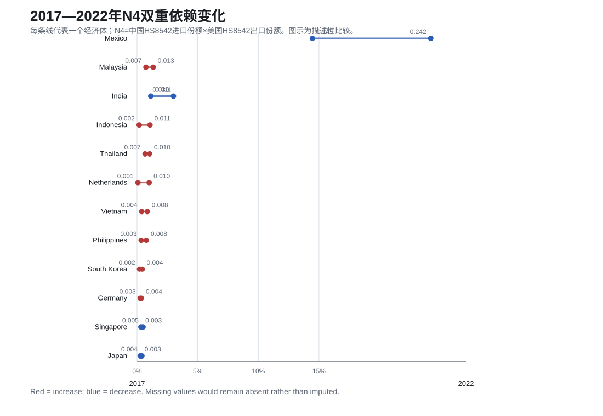
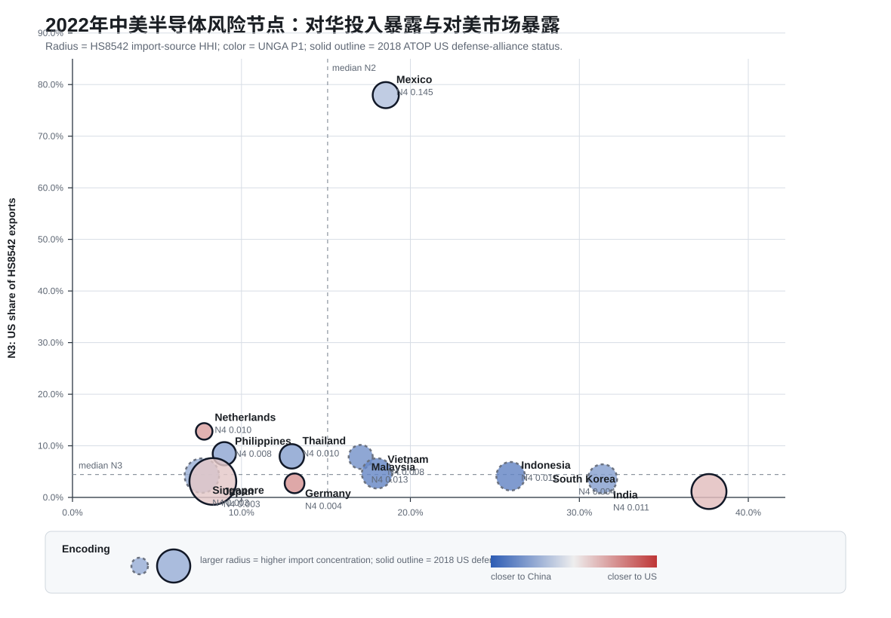
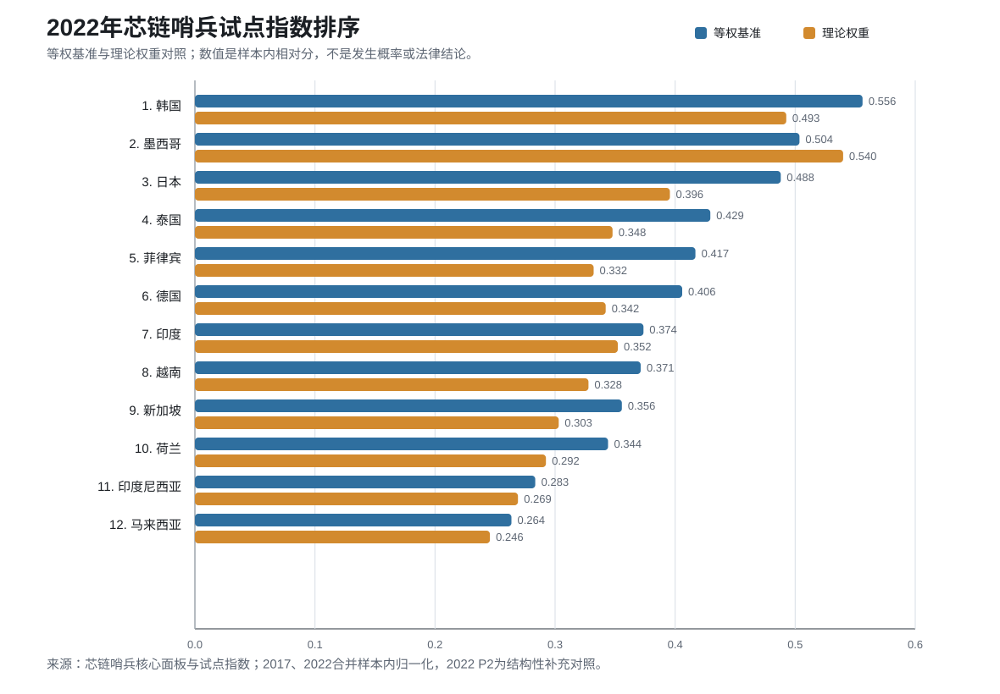

# 芯链哨兵：脱钩之后，风险去了哪里？
## 中美科技竞争下第三方半导体供应链风险观察

### 摘要

中国半导体企业把采购、生产和销售放到第三方经济体，可以降低部分直接暴露，却不一定让风险消失。中国投入、美国市场、东道国政治位置和供应来源集中度，可能在新的节点重新交叉。本文选取马来西亚、越南、新加坡、泰国、印度、印度尼西亚、菲律宾、日本、韩国、墨西哥、德国和荷兰，比较2017年与2022年的半导体供应链结构。

结果显示，2022年墨西哥仍是样本中N4双重依赖最高的国家，但N4低于2017年；荷兰、印度尼西亚、马来西亚、越南、菲律宾、泰国、韩国和德国的N4上升，说明风险在节点之间重新分布，并不是简单地从一个国家消失。项目使用UN Comtrade、UNGA Voting Ideal Points、ATOP v5.1、OECD TiVA 2025和BIS公开规则等资料，给出一个用于筛查的“芯链哨兵”试点指数。P3规则目前已完成机器筛选和定向人工核对，但尚未完成覆盖实体、产品范围及例外条款的逐条法律复核，因此只作为独立的政策预警层，不把实体级措施直接当成国家分数。

### 一、研究问题

我们关心的不是一般国别风险，而是中国半导体企业使用第三方节点后，风险会沿哪条链路传导。这里有三个实际问题：东道国的政策位置会不会改变约束条件；中国投入和美国客户是否同时形成依赖；如果一条链路中断，企业能不能找到替代来源。

研究对象固定为12个经济体，2022年为基准年，2017年用于回看。指标分成政治背景（P）、网络暴露（N）和产业脆弱性（V）三层，分别对应政策环境、投入/市场通道和替代能力。

### 二、指标与数据

P1用联合国大会理想点衡量各国相对中美的位置。以目标年为中心取三年窗口，分别计算该国到中国和美国的平均距离，再用“到中国距离÷两者距离之和”得到相对位置。数值越大，说明位置相对更靠近美国。这个窗口用于跨年结构比较，不把它解释成严格的无前视预测值。

P2原本来自ATOP v5.1的美国正式防务联盟关系。2017年使用直接观察值；由于ATOP公开覆盖到2018年，2022年改用美国国务院公开的集体防御安排和北约成员名单，2018年ATOP状态另列为交叉资料。这样做是为了补足2022年的结构信息，也避免把旧状态冒充成动态序列。

P3来自BIS历史规则和实体清单中的政策证据。当前流程先用规则字段和文本关键词筛选候选，再对命中条目做定向人工核对，并区分“文本提到一个国家”和“法律明确适用于该国实体”这两种情况。由于尚未完成覆盖全部实体、产品范围和例外条款的逐条法律复核，P3目前只负责提示待复核的政策事件，不进入国家总分。

N1为OECD TiVA C26_27电子产业的外国增加值占出口比重。N2是从中国进口HS8542占该国全球HS8542进口的比例，N3是对美国出口HS8542占全球HS8542出口的比例，N4=N2×N3，用来表示同时依赖中国投入和美国市场的夹层结构。V1是进口来源HHI，V2是进口份额达到1%的有效供应国数量。贸易主表统一使用研究国自报数据，清洗时去掉World及地区汇总项。

### 三、测量验证

**图1 2017—2022年N4双重依赖变化**

**图2 2022年中美半导体风险节点**

**图3 2022年试点指数排序**

图1看跨年变化，图2看中国投入端和美国市场端的组合位置，图3把等权基准与理论权重放在一起，直观看出权重设定会改变部分国家的排序。三张图都来自同一份核心面板与试点指数，不把排名解释成发生概率。

外部对照方面，2022年马来西亚的N2、N3、N4、V1、V2分别为0.1706、0.0784、0.01338、0.14835和13；越南分别为0.18024、0.04659、0.00840、0.20627和9，均落在预先设定的容差内。内部检查中，24条观测的N4与N2×N3最大误差约为9.19×10^-17，国家—年份键没有重复，份额和HHI均在0—1范围。2017—2022年跨国排序相关为：P1 0.958、N2 0.636、N3 0.524、N4 0.434、V2 0.292。这些结果说明政治位置较稳定，贸易通道和替代来源变化更快；由于P1使用中心窗口，这里是结构比较，不是严格的无前视回测，也不是未来预测准确率。

### 四、试点指数

为便于比较，先把各指标统一到0—1方向，再把2017和2022年24条观测放在一起做样本内min-max归一化；V2取反后再归一化。等权版本使用P1、P2、N1、N2、N3、N4、V1和反向V2八个字段取平均。理论权重版本提高N4权重，用来观察排序是否依赖某一种权重设定。

2022年更新P2后的等权排名前五为韩国、墨西哥、日本、泰国和菲律宾；理论权重版把墨西哥列为第一，韩国第二、印度第四。两种结果不完全相同，说明指数适合做尽调排序，不适合被理解为一个精确的“安全分数”。N2、N3和N4来自同一依赖机制，解释时不能把它们当作三个互不相关的因果变量。

### 五、主要发现

墨西哥2022年N4为0.14456，在样本中最高，但比2017年的0.24209低。荷兰、印度尼西亚、马来西亚、越南、菲律宾、泰国、韩国和德国的N4上升，其中荷兰和印度尼西亚的增幅较明显。由此可以看到，第三方布局带来的并非单向“脱离风险”，而是把部分风险移到同时连接中国投入与美国市场的节点。

不同国家的风险来源也不一样。N2较高时，应先查中国投入中断和合规审查；N3较高时，应关注美国客户、最终用户和再出口条款；V1较高或V2较低时，即便贸易依赖不算最高，也要防止替代供应不足。P1和P2只描述政策背景，不能直接推断企业一定会被某一方控制。

### 六、给企业的用法

企业可以先用试点指数排出尽调顺序，再打开国家画像查看N2、N3、N4、V1和V2。对墨西哥这类N4较高的节点，要同时核查中国设备、材料和零部件来源，以及美国客户的最终用户、原产地和再出口条款。对荷兰、印度尼西亚等N4上升国家，应增加季度监测和第二来源认证。对V2较低的国家，要核验经销商背后的实际生产地，做交期和港口替代压力测试。P3预警层适合记录规则新增、修改、移除和混合动作，但不应只凭一个规则标题就停止投资或更换供应商。

网页另设企业级扫描页，把企业自己的BOM、供应商和客户清单按国家汇总，再与核心面板逐项对照。它输出的是“先筛选、再解释、后行动”的尽调队列，不是把企业样本重新包装成一个新的国家分数。P3事件只有在人工复核状态为confirmed、且能和企业国家或实体匹配时才显示；没有导入企业清单时，页面只展示明确标注的演示数据。

### 七、工具辅助与人工复核

本项目使用了AI和脚本来批量整理Comtrade数据、检查公式、记录异常、筛选公开法规中的候选文本，并搭建网页原型。研究问题、指标定义、马来西亚和越南基准核验、P3能否入表等关键判断由人工完成。早期文本扫描曾把“国家被提及”误认为“国家被管制”，复核后才保留现在的边界。这个例子也说明，工具可以提高检索和整理速度，但不能替代法律语义判断。

### 八、局限与下一步

本研究仍受ATOP时间覆盖、HS8542四位口径、企业内部供应商和客户数据缺失等限制。P3候选规则目前只完成机器筛选和定向人工核对，尚未形成可以替代法务意见的逐条法律证据台账；从政策规则到具体企业暴露还需要企业实体、产品和交易路径。GDELT中美双边事件库可作为外部事件提醒，不把无法直接复核的网页汇总值放进主分数。下一步应先完成P3逐条法律复核，再把已确认规则事件与企业BOM、供应商和客户名单连接，形成“筛选—解释—行动”的企业级版本。

### 九、结论

2017—2022年的数据表明，第三方供应链不是天然的避风港。风险可能从直接的中美关系，转化为投入、客户、政策和替代来源交织的组合暴露。芯链哨兵把这种变化拆成P、N、V三层，并用N4识别“同时依赖中国投入与美国市场”的夹层节点。它的用途是帮助企业决定先查哪里、先做哪项替代，而不是替企业作出单一的投资结论。

本项目的所有分数均应结合来源、时间和缺失说明阅读。15项质量检查通过，只代表主键、公式、范围、基准和来源覆盖能够复核，不等同于因果效度或未来预测准确率。
